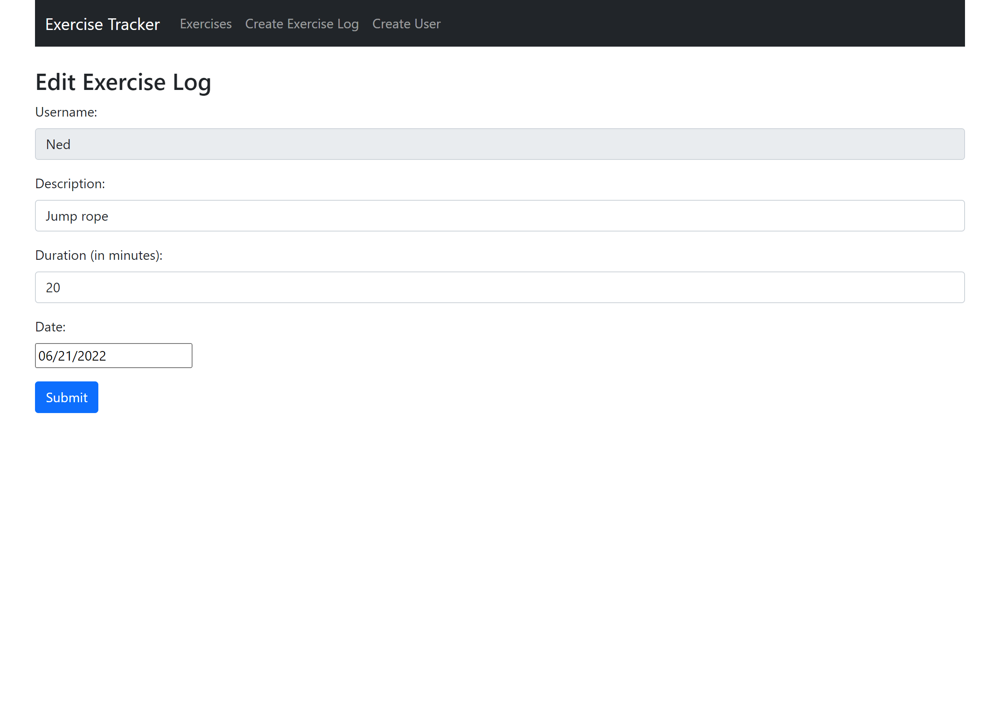
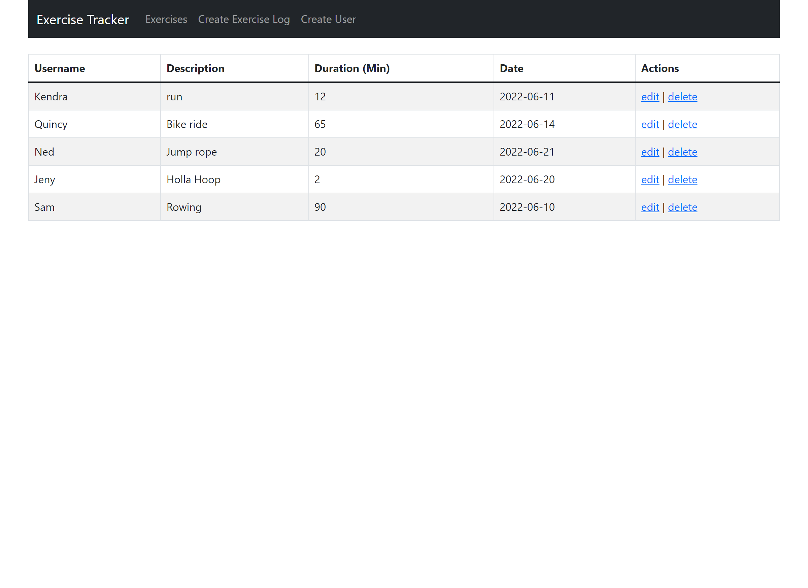

# Activity Tracker
I made a simple CRUD api that accepted usernames and allowed for physical activity events to be assigned to each user based on exercise description, duration, and date. The api was dictated with Node/Express and the data was stored using MongoDB. 

A React app was then created to visualize the activity enteries and provide frontend functionality to update, delete, and create additional instances in the user log. Notable dependencies involved were Bootstrap for form styling, React-Router was used for page navigation/dynamic routing, and Axios which enabled communication with the backend.

This app served as a prototype for a larger project that I have been working on that aims to synchronize user activity management and a instructional exercise library into a virtual platform for personal training.

## Tech Used:
React, JavaScript, Node, Express (Mongoose), MongoDB

## Lessons Learned:
* This was my first time putting React-Router into practice. It really gave me an appreciation for single page applications as nagivating different views within the app became really dynamic and seamless. 

<table>
<tr>
    <td width="50%" valign="top">
        
    </td>
    <td width="50%" valign="top">
        
    </td>
</tr>
</table>

### Acknowledgements: 
freeCodeCamp.org MERN Course